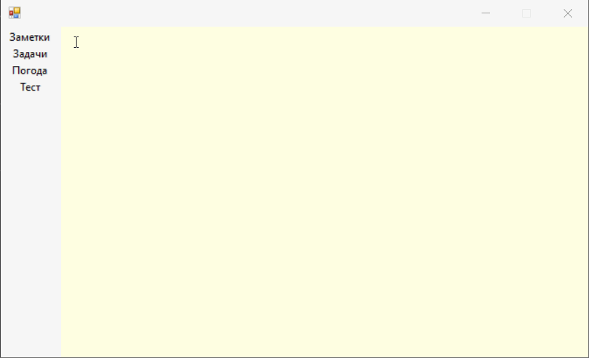

## Notes
# Приложение, позволяющее создавать заметки, задачи с напоминаниями, а также отслеживающее погоду через openweather. 

Работает на базах данных, связанных про принципу многие-ко-многим. 

# Вот как это выглядит:

Предполагается, что после запуска приложение висит в трее, но и при перезапуске приложения или компьютера при повторном включении программа вычисляет, о каких событиях вам нужно (было) напомнить. 

